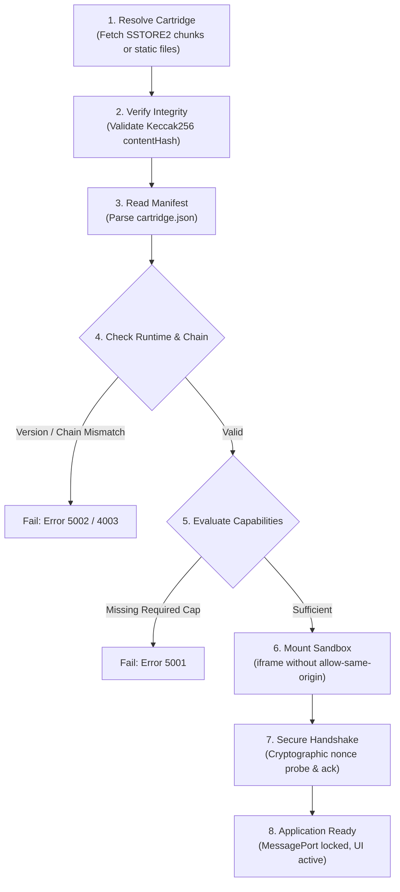

# Cartridge V0.1 Specification (Hardened)

## 1. Overview

**Cartridge V0.1** defines the packaging, manifest declaration, permissions, and lifecycle of an application targeting the **Console Runtime V0.1**.

A cartridge is an isolated, self-contained application package. It may be deployed entirely on-chain (e.g. HoodQuest's SSTORE2 chunks) or hosted on a decentralized content network, executing inside a sandboxed browser environment or native webview.

---

## 2. Package Structure

```text
cartridge/
├── cartridge.json          # Standard manifest declaring identity, requirements, policy, and integrity
├── index.html              # HTML5 entrypoint (or configured entry in manifest)
├── assets/                 # (Optional) Static visual, audio, or game data
└── runtime/                # (Optional) Console Runtime V0.1 client module
```

---

## 3. Hardened Cartridge Manifest (`cartridge.json`)

The manifest acts as the formal contract between the cartridge and the host console.

### Forward Compatibility & Versioning Rules
* **Explicit Schema Version**: Manifests must declare `schemaVersion: "0.1.0"`.
* **Runtime Range**: Must declare `runtime.version` (e.g. `"^0.1.0"`).
* **Unknown Optional Fields**: Console hosts MUST ignore unknown top-level or metadata fields to allow future backward-compatible extension.
* **Unknown Required Capabilities**: Console hosts MUST fail closed with Error `5001` (`CapabilityNotGranted`) if a cartridge requires an unknown capability.
* **Immutable Content Hashes**: When deployed, the manifest or registry includes `integrity.contentHash` and `integrity.compressedHash` (Keccak256).
* **Manifest Trust Requirement & Registry Anchor Invariant**: A production third-party release must anchor an immutable manifest hash in a trusted registry (such as an on-chain Cartridge Registry contract). The verified manifest then anchors the cartridge package content hash and exact dependency hashes. Without this immutable registry anchor, an attacker controlling the delivery channel could replace both the package and the manifest together, defeating package content hash verification.

### Reference Implementation: HoodQuest (#0001)
```json
{
  "schemaVersion": "0.1.0",
  "id": "hoodquest",
  "name": "HoodQuest: Sanctuary of the Falcon",
  "version": "1.0.0",
  "runtime": {
    "version": "^0.1.0",
    "transport": "auto"
  },
  "entry": "index.html",
  "chainId": 11155111,
  "capabilities": {
    "required": ["evm.read"],
    "optional": ["wallet.identity", "evm.write", "events.accounts", "events.chain", "events.capabilities"]
  },
  "permissions": {
    "contracts": [
      {
        "address": "0xF75323518df7Ce90637e2b93cFd7f7d0627cc205",
        "name": "Outlaws",
        "writes": true,
        "allowNativeValue": false,
        "isElevated": false
      },
      {
        "address": "0x0676129B2bF4B06f04AfC7301617b6cE3BB2405c",
        "name": "Loot",
        "writes": false,
        "allowNativeValue": false,
        "isElevated": false
      },
      {
        "address": "0xC115C51a1bf9DdE7B1eD0861E18CaA27f24C3Be9",
        "name": "Vault Heist / Raids",
        "writes": true,
        "allowNativeValue": false,
        "isElevated": false
      }
    ]
  },
  "integrity": {
    "contentHash": "0x8a883ea5b9e8497de85abdd1007af9454d01c49e6594bd1743175de0ea0456c0",
    "compressedHash": "0xcdd2f3635a20484381a7d0952bc388c8df6d877fedbb1eee4561a9cab79040b5"
  },
  "metadata": {
    "author": "SRHSoulja",
    "canonicalUrl": "https://srhsoulja.github.io/hoodquest/"
  }
}
```

---

## 4. Permission Model: Requested vs. Granted Permissions

Security requires strict segregation between **requested** permissions and **granted** permissions:

```text
┌──────────────────────────────────────────────────────────┐
│                   CARTRIDGE MANIFEST                     │
│   Declares: "I request writes to Outlaws & Raids"        │
│   (Requested Permissions)                                │
└────────────────────────────┬─────────────────────────────┘
                             │ submitted to host
┌────────────────────────────▼─────────────────────────────┐
│                      CONSOLE HOST                        │
│   Evaluates: User consent, security policy, chain rules  │
│   Grants: Granular Policy (Chain + Target + Selectors)   │
│   (Granted Permissions)                                  │
└────────────────────────────┬─────────────────────────────┘
                             │ evaluated on evm.write
┌────────────────────────────▼─────────────────────────────┐
│                 HOST SECURITY BOUNDARY                   │
│   Checks: Target in policy?                              │
│           Selector permitted?                            │
│           Elevated operation (approval/transfer)?        │
│           Native value within limits?                    │
│           Chain ID matches active chain?                 │
│   If valid -> Prompt Signer                              │
│   If invalid -> Fail Closed (Error 4003 PolicyViolation) │
└──────────────────────────────────────────────────────────┘
```

* **A cartridge must never self-authorize.**
* **Elevated Asset Operations**: Token/NFT approvals (`setApprovalForAll`, `approve`) and transfers (`transferFrom`, `safeTransferFrom`) are blocked by default. Ordinary contract write permissions never implicitly grant elevated authority.

---

## 5. Formal Cartridge Lifecycle



### Failure Behaviors

| Condition | Host Action | Cartridge Behavior |
| :--- | :--- | :--- |
| **Unsupported Runtime Version** | Host halts launch before boot; displays incompatible runtime modal. | Never executes. |
| **Missing Required Capability** | Host aborts initialization with Error `5001` (`CapabilityNotGranted`). | Halts during boot. |
| **Unsupported Chain** | Host prompts user to switch chain or loads cartridge in read-only inspection mode. | Disables write UI; displays switch network prompt. |
| **Malformed Manifest / Hash Mismatch** | Host rejects package verification (Error `5003`). | Never executes. |
| **Rejected Permission** | Host removes target from granted allowlist. | Receives error `4003` if attempting write to rejected target. |
| **Elevated Asset Attempt** | Host blocks unauthorized approval or transfer. | Receives error `4003` (`Elevated asset operation blocked`). |
| **Chain Switched While Running** | Host emits `wallet.chainChanged` and invalidates pending authorizations. | Receives error `4003` (Chain policy mismatch) or EIP-1193 `4901` on disconnected provider. |
| **Account Disconnected** | Host emits `wallet.accountsChanged` and revokes write capability. | Receives error `4100` on write attempts. |
| **Read-Only / Sandboxed Host** | Host sets `signing: false`, `contractWrite: false`. | Operates in non-mutating preview / exhibition mode. |

---

## 6. Preparation for Generic Web Host (Future Stage)

Any compatible host platform must provide:
1. **Manifest Resolver**: Reads `cartridge.json` from disk, IPFS, or decompressed SSTORE2 on-chain storage.
2. **Permission Gatekeeper**: Displays requested contract write targets to the user and manages granted permission sets.
3. **Transport Channel Provider**: Binds an isolated `MessagePort` upon receiving authenticated `cartridge:handshake`.
4. **RPC Bridge Dispatcher**: Routes `evm.read` to configured RPC nodes and forwards `evm.write` to the user's active signer.
5. **Universal Host Chrome**: Displays connection status, active network indicator, and security override controls outside the cartridge iframe.
