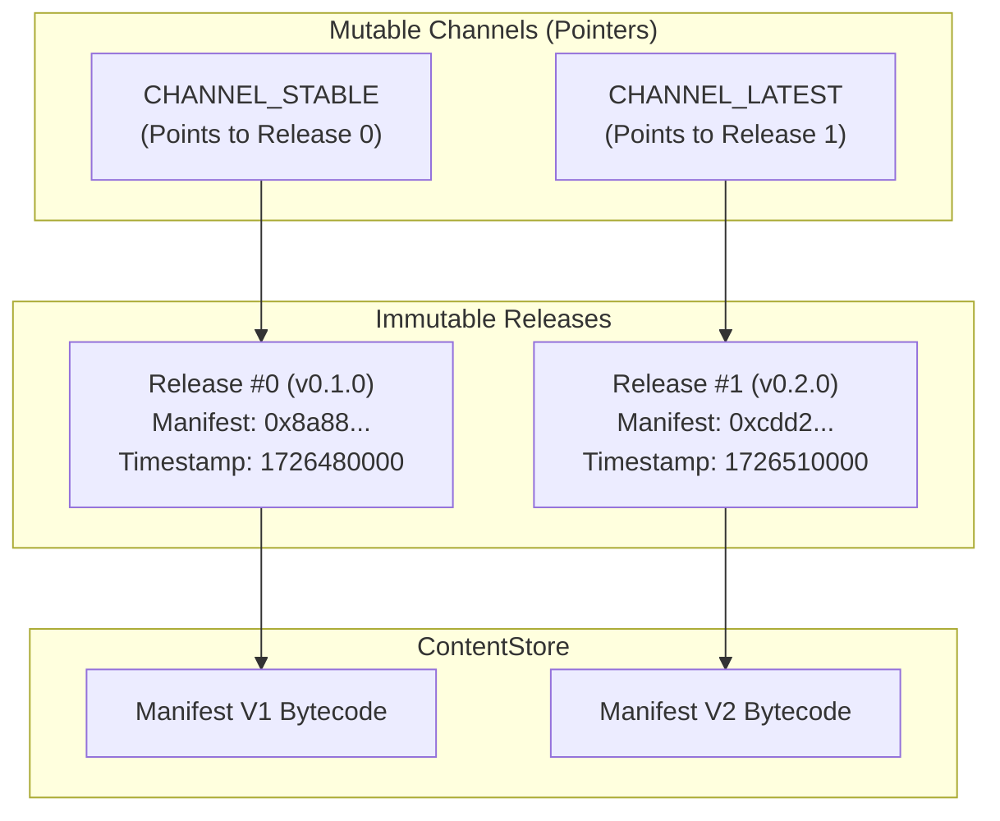

# CartridgeRegistry Specification

**Status**: Prototype Specification & Reference Implementation  
**Contract**: `src/protocol/CartridgeRegistry.sol`  

---

## 1. Overview

`CartridgeRegistry` provides the decentralized namespace and release tracking layer for the Console platform.

It is architected around one central invariant:
> **Releases are immutable cryptographic records; Channels are mutable publisher pointers.**

Once a publisher commits a release with a given `manifestDigest`, that release record can never be modified or overwritten. However, publishers can point mutable distribution channels (such as `stable` or `beta`) to any valid historical release.

---

## 2. Cartridge Identity Model

Cartridges are identified by a globally unique 32-byte hash:

$$\text{cartridgeId} = \text{keccak256}(\text{abi.encodePacked}(\text{publisherAddress}, \text{cartridgeName}))$$

This prevents namespace squatting:
- Author `0xA11CE` registering `"hoodquest"` creates a unique ID owned exclusively by `0xA11CE`.
- Author `0xB0B` registering `"hoodquest"` creates a distinct, conflict-free ID.

---

## 3. Releases vs Channels



### Immutable Release Records
```solidity
struct Release {
    bytes32 manifestDigest; // Cryptographic hash of canonical manifest in ContentStore
    uint64 publishedAt;      // Block timestamp of publication
    string version;          // Semantic version string (e.g. "1.0.0")
}
```

### Standard Channels
- `CHANNEL_STABLE = keccak256("stable")`: Recommended release for general player consumption.
- `CHANNEL_LATEST = keccak256("latest")`: Automatically updated to the most recent published release.
- `CHANNEL_BETA = keccak256("beta")`: Pre-release testing channel.

---

## 4. Resolution Interface

Resolvers (such as `OnchainCartridgeResolver`) query the registry using a single view call:

```solidity
function resolveManifest(bytes32 cartridgeId, bytes32 channelKey) 
    external 
    view 
    returns (bytes32 manifestDigest);
```

The resulting `manifestDigest` is then used to load the canonical manifest document directly from `ContentStore.read(manifestDigest)`.
