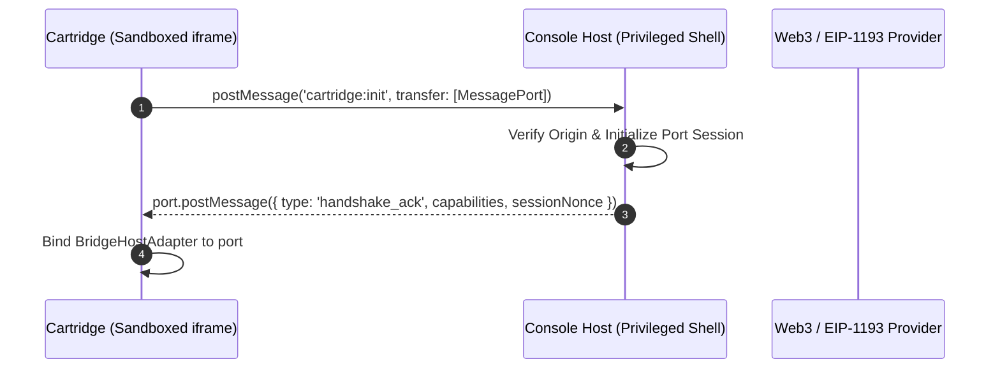

# Console Protocol V0.2 Specification

**Status**: Draft / Prototype Specification  
**Version**: 0.2.0  
**Target Runtimes**: Browser Environments, Sandboxed Iframes, Standalone Web Apps  
**Compatible Cartridge Protocols**: Cartridge Protocol V0.1, Cartridge Protocol V0.2  

---

## 1. Overview

The **Console Protocol** specifies the bidirectional communication bridge and security boundary between a host container (the Console Host) and an untrusted application payload (the Cartridge).

In Console Protocol V0.2, the runtime introduces:
1. **Generic Event Log Queries (`evm.logs`)**: Enabling direct, indexer-free log inspection (`eth_getLogs`) across smart contracts with fail-closed chain gating and deterministic result normalization.
2. **CAIP-2 Chain Identifier Interoperability**: Support for blockchain-agnostic identifiers (e.g. `eip155:11155111` for Ethereum Sepolia) alongside legacy hexadecimal IDs.
3. **Pluggable Architecture**: Seamless interoperation between `LocalCartridgeResolver` and `OnchainCartridgeResolver`.

---

## 2. Capability Negotiation

When a cartridge boots inside a sandboxed iframe, it initiates capability negotiation with the host container via a MessageChannel handshake.



### Initial Capabilities Object

```json
{
  "adapter": "bridge",
  "wallet": {
    "supported": true,
    "connected": false,
    "address": null,
    "providerName": "Console Host"
  },
  "evm": {
    "chainId": "0xaa36a7",
    "read": { "supported": true, "available": true },
    "logs": { "supported": true, "available": true },
    "write": { "supported": true, "available": false, "authorized": true }
  },
  "environment": {
    "isSandboxed": true,
    "hasHostBridge": true,
    "openExternalApp": false,
    "canonicalAppUrl": "https://..."
  }
}
```

---

## 3. Remote Procedure Call (RPC) Methods

All communication over the established `MessagePort` uses a JSON-RPC 2.0-compliant frame format:

```typescript
interface ConsoleRpcRequest {
  jsonrpc: "2.0";
  id: string | number;
  method: string;
  params?: Record<string, any>;
}

interface ConsoleRpcResponse {
  jsonrpc: "2.0";
  id: string | number;
  result?: any;
  error?: {
    code: number;
    message: string;
    data?: any;
  };
}
```

### Supported Methods

| Method | Parameters | Return Type | Description |
| :--- | :--- | :--- | :--- |
| `wallet.address` | `{}` | `string \| null` | Returns the currently active checksummed address |
| `wallet.connect` | `{}` | `string[]` | Requests user authorization to connect wallet |
| `wallet.disconnect` | `{}` | `boolean` | Disconnects the active session |
| `evm.read` | `{ to: string, data: string }` | `string` (hex) | Executes read-only contract call (`eth_call`) |
| `evm.write` | `{ to: string, data: string, value?: string, chainId?: string }` | `string` (txHash) | Dispatches transaction after policy firewall verification |
| `evm.receipt` | `{ txHash: string, maxAttempts?: number }` | `object \| null` | Polls for transaction receipt (`eth_getTransactionReceipt`) |
| `evm.logs` | `{ fromBlock?, toBlock?, address?, topics?, blockHash?, chainId? }` | `NormalizedLog[]` | Queries on-chain event logs (`eth_getLogs`) |

---

## 4. `evm.logs` Specification

The `evm.logs` primitive allows cartridges to discover state transitions, transfers, and game occurrences without reliance on external commercial indexers.

### Filter Parameters

```typescript
interface LogFilter {
  fromBlock?: string | number;
  toBlock?: string | number;
  address?: string | string[]; // 20-byte hex address(es)
  topics?: Array<string | string[] | null>; // 32-byte hex topics
  blockHash?: string;
  chainId?: string; // Optional: must match active host chain
}
```

### Chain Validation Invariant

If the cartridge specifies a `chainId` in its log filter, the host MUST validate that `normalizeChainId(filter.chainId) === host.activeChainId`. If there is a mismatch, the host MUST fail closed with error code `4901` (`ConsoleRuntimeError.chainDisconnected`).

### Return Normalization

The host normalizes raw RPC log representations into consistent, lowercase hex structures:

```typescript
interface NormalizedLog {
  address: string;          // Lowercase 20-byte hex string
  topics: string[];         // Lowercase 32-byte hex strings
  data: string;             // Raw hex data string
  blockNumber: string;      // Canonical hex representation (e.g. '0x1e240')
  blockHash: string;        // Hex string
  transactionHash: string;  // Hex string
  transactionIndex: string; // Canonical hex representation
  logIndex: string;         // Canonical hex representation
  removed: boolean;         // Reorganization indicator
}
```

---

## 5. Standard Error Codes

Console Protocol strictly delineates between standard EIP-1193 provider errors and runtime policy violations:

| Error Code | Constant / Name | Description |
| :--- | :--- | :--- |
| `4001` | `UserRejected` | User rejected the request (e.g. signature rejection) |
| `4100` | `Unauthorized` | Account is not authorized or wallet is disconnected |
| `4200` | `UnsupportedMethod` | The requested method is not recognized by the host |
| `4900` | `Disconnected` | Provider is disconnected from all chains |
| `4901` | `ChainDisconnected` | Provider is disconnected from the specified chain |
| `4003` | `PolicyViolation` | Contract target, selector, chain, or value disallowed by host policy |
| `-32602`| `InvalidParams` | Malformed RPC parameters or invalid filter schema |
| `5003` | `IntegrityFailure` | Content hash mismatch between manifest and payload |
